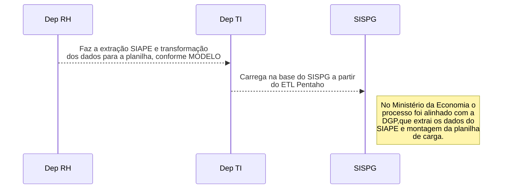

# Sugestão para Carga de dados do Programa de Gestão!

Descreve-se abaixo sugestões para procedimentos no processo de carga e manutenção de dados no Sistema de Programa de Gestão, aqui chamado SISPG, ferramenta de apoio tecnológico para acompanhamento e controle do cumprimento de metas e alcance de resultados nos termos da Instrução Normativa Nº 65, de 30 de julho de 2020. Esse é um documento técnico destinado às áreas de tecnologia dos órgãos que adotaram o SISPG como ferramenta de gestão do teletrabalho. 

> **Importante:** Este manual não tem caráter exaustivo, sendo portanto, ferramenta de apoio à compreensão dos procedimentos a serem adotados para a carga do banco de dados.

A carga de dados se dá a partir do sistema de recursos humanos do órgão para a base do SISPG pela extração dos dados do SIAPE. As tabelas que devem ser populadas são: **Unidade, Pessoa e Função**.

### Fluxo proposto:

## Passo a passo para utilização da solução

> **1.**  Extrair todos os arquivos do .ZIP.

> **2.** Petanho precisa estar configurado e instalado com a biblioteca JTDS instalada em **C:\data-integration\lib** (copiar o arquivo .JAR aqui). Disponível para download em:  https://sourceforge.net/projects/jtds/

> **3.** Abrir o arquivo PROG_GESTAO_JOB_UNICO no pentaho.

> **4.**  Abrir o step "Set variables" e configurar as seguintes variáveis:
>>**4.1.** CAMINHO_DO_ARQUIVO: valor deve apontar para o .xlsx
>>**4.2.** DB_host: endereço IP do servidor do banco de dados
>>**4.3.** DB_user: usuário do banco de dados
>>**4.4.** DB_senha: senha desse usuário
>>**4.5.** DB_porta: porta de rede 
>>**4.6.** DB_nome: nome do banco

>**5.** Rodar o JOB localmente. (Run, ou apertar F9)
